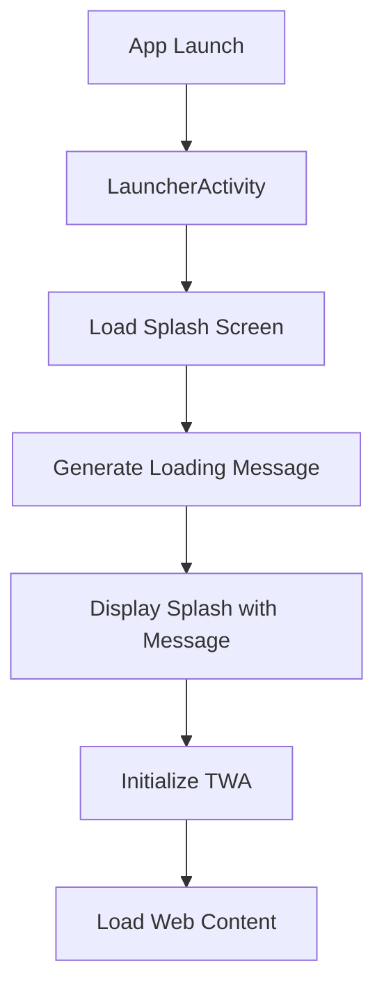

# Design Document: Quizee Loading Rebrand

## Overview

This design covers the rebranding of loading screens from Playshares to Quizee in the Android TWA application, including the addition of dynamically generated loading messages. The changes primarily involve updating configuration files and adding a loading message generator to the LauncherActivity.

## Architecture

The TWA application uses a standard Android architecture with:
- **LauncherActivity**: Entry point that displays the splash screen and initializes the TWA
- **Configuration Files**: JSON and XML files that define branding, colors, and metadata
- **Resource Files**: Drawables, strings, and colors that define visual appearance



## Components and Interfaces

### 1. Web App Manifest (web_app_manifest.json)
Updates required:
- `name`: "Playshares" → "Quizee"
- `short_name`: "Playshares" → "Quizee"
- `icons`: Update paths to use Quizee icon naming convention

### 2. Loading Message Generator
New component in LauncherActivity:
- Array of predefined Quizee-themed loading messages
- Random selection method to pick a message at startup
- Display integration with splash screen layout

### 3. Splash Screen Layout
Modifications to display loading message:
- Add TextView below logo for loading message
- Style with Quizee brand colors
- Center-aligned text with appropriate font size

## Data Models

### Loading Messages Array
```java
private static final String[] LOADING_MESSAGES = {
    "Getting your quiz ready...",
    "Loading brain teasers...",
    "Preparing fun questions...",
    "Warming up the quiz engine...",
    "Almost there...",
    "Loading awesome quizzes...",
    "Get ready to test your knowledge!",
    "Shuffling the questions...",
    "Loading your challenge...",
    "Quiz time is coming!"
};
```

### Web App Manifest Structure
```json
{
  "name": "Quizee",
  "short_name": "Quizee",
  "start_url": "/",
  "display": "standalone",
  "background_color": "#F8FAFC",
  "theme_color": "#6366F1",
  "icons": [...]
}
```

## Correctness Properties

*A property is a characteristic or behavior that should hold true across all valid executions of a system-essentially, a formal statement about what the system should do. Properties serve as the bridge between human-readable specifications and machine-verifiable correctness guarantees.*

Based on the prework analysis, the following property is testable:

### Property 1: Loading message selection always returns valid message
*For any* random seed value, when the loading message generator selects a message, the returned message SHALL be a member of the predefined LOADING_MESSAGES array.

**Validates: Requirements 2.1**

## Error Handling

### Configuration Errors
- If web_app_manifest.json is malformed, the app falls back to default TWA behavior
- Missing loading messages array defaults to empty string (no message displayed)

### Resource Loading Errors
- Missing splash drawable falls back to solid background color
- Missing color resources use Android default theme colors

## Testing Strategy

### Unit Testing
- Verify loading message generator returns values from the predefined list
- Verify random selection produces varied results over multiple calls

### Property-Based Testing
Using JUnit with a simple property test approach:
- Test that for 100+ random seeds, the message selector always returns a valid message from the array
- Each property test tagged with: `**Feature: quizee-loading-rebrand, Property 1: Loading message selection**`

### Manual Verification
- Visual inspection of splash screen with Quizee branding
- Grep search for "Playshares" returns zero results
- APK installation and launch verification on device/emulator

### Build Verification
- Signed APK generation with existing keystore
- APK signature verification
